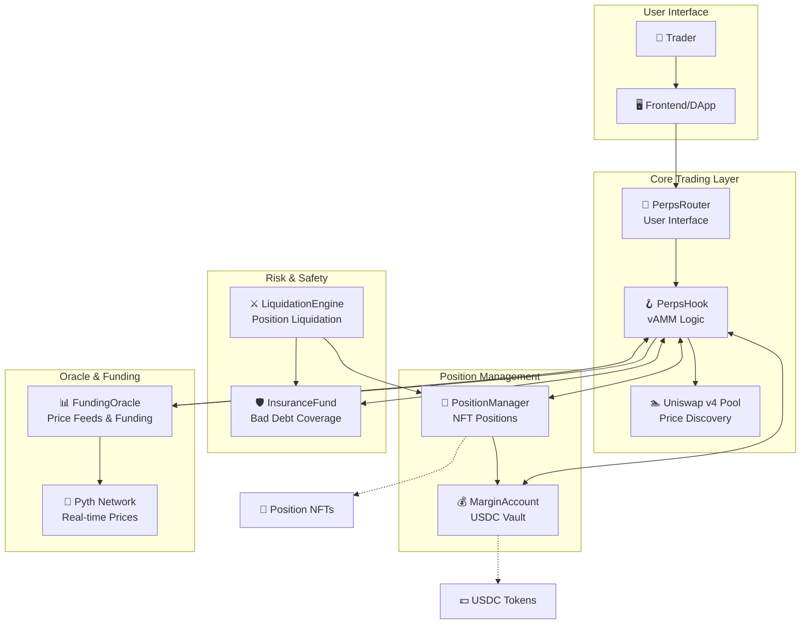

# 🚀 UniPerp - Virtual AMM Perpetuals on Uniswap v4

[](https://opensource.org/licenses/MIT)
[](https://docs.soliditylang.org/)
[](https://getfoundry.sh/)
[](https://docs.uniswap.org/contracts/v4/overview)
[](https://pyth.network/)

> **A complete decentralized perpetual futures exchange built on Uniswap v4, featuring virtual AMMs, integrated margin management, real-time funding rates, and robust risk management.**

## 🌟 Key Features

- **⚡ High Leverage Trading**: Up to 20x leverage on perpetual futures
- **🔄 Virtual AMM**: Zero external liquidity providers - pure virtual reserves
- **🎯 Price Impact Simulation**: Realistic price discovery without real liquidity
- **💰 Dynamic Funding Rates**: Automated funding payments with Pyth oracle integration
- **🛡️ Multi-Layer Risk Management**: Liquidation engine + insurance fund safety net
- **🏛️ Fully Decentralized**: No centralized components or order books
- **🎨 NFT Position Tokens**: Each position is a tradeable ERC-721 NFT
- **🏦 Unified Margin System**: Single USDC vault manages all collateral
- **🔗 Complete Integration**: All components tested and working together
- **📊 Real-Time Oracles**: Pyth Network integration for accurate pricing

## 📋 Table of Contents

- [📚 Documentation](#-documentation)
- [🌐 Live Deployment](#-live-deployment)  
- [🏗️ System Architecture](#️-system-architecture)
- [🔄 How It Works](#-how-it-works)
- [🚀 Quick Start](#-quick-start)
- [⚙️ Installation](#️-installation)
- [📖 Usage Examples](#-usage-examples)
- [📋 Smart Contracts](#-smart-contracts)
- [🧪 Testing](#-testing)
- [🚀 Deployment](#-deployment)
- [🛡️ Security](#️-security)
- [🤝 Contributing](#-contributing)

## 📚 Documentation

### 🚀 Developer Guides

**New to UniPerp? Start here:**
- **[⚡ Quick Start Guide](./docs/QUICK_START.md)** - Get trading in 5 minutes
- **[🔧 Developer Integration Guide](./docs/DEVELOPER_INTEGRATION_GUIDE.md)** - Complete integration documentation
- **[📖 Examples Guide](./docs/EXAMPLES_GUIDE.md)** - Practical code examples and patterns
- **[📋 API Reference](./docs/API_REFERENCE.md)** - Comprehensive contract interface documentation

### 📖 System Documentation

**Deep dive into the architecture:**
- **[📋 System Architecture](./docs/01_System_Architecture.md)** - High-level overview and component relationships
- **[🔄 Virtual AMM Mechanism](./docs/02_Virtual_AMM_Mechanism.md)** - How the virtual AMM works
- **[🎣 Hook Integration](./docs/03_Hook_Integration.md)** - Uniswap V4 hook implementation details
- **[📋 Contract Overview](./docs/04_Contract_Overview.md)** - Detailed breakdown of all smart contracts
- **[💱 Trading Flow](./docs/07_Trading_Flow.md)** - Step-by-step trading process
- **[🎣 Hook Data Flow](./docs/15_Hook_Data_Flow.md)** - Hook interaction patterns

## 🌐 Live Deployment

### Unichain Sepolia Testnet

All contracts are deployed and verified on **Unichain Sepolia** network:

| Contract | Address | Etherscan |
|----------|---------|-----------|
| **MockUSDC** | [`0xE30A0272E532A8AE4Bd9BFd9F9676CcC447012eb`](https://sepolia.uniscan.xyz/address/0xE30A0272E532A8AE4Bd9BFd9F9676CcC447012eb) | ✅ Verified |
| **MockVETH** | [`0x3D52642b8AC6fbc02f3306BE19e7bF6942083424`](https://sepolia.uniscan.xyz/address/0x3D52642b8AC6fbc02f3306BE19e7bF6942083424) | ✅ Verified |
| **PerpsHook** | [`0x31F2128164886E6BFd4A791c16412A4Df3F6dac8`](https://sepolia.uniscan.xyz/address/0x31F2128164886E6BFd4A791c16412A4Df3F6dac8) | ✅ Verified |
| **PerpsRouter** | [`0x48f20d3AEDFa76d305dAfB51214769C6c5312Bec`](https://sepolia.uniscan.xyz/address/0x48f20d3AEDFa76d305dAfB51214769C6c5312Bec) | ✅ Verified |
| **PositionManager** | [`0x3DdffBE895f2D6B7fBccF7E3139362Acdb3024D7`](https://sepolia.uniscan.xyz/address/0x3DdffBE895f2D6B7fBccF7E3139362Acdb3024D7) | ✅ Verified |
| **MarginAccount** | [`0x24F6bb793c6EaF523696351BBB21e3C5b8686514`](https://sepolia.uniscan.xyz/address/0x24F6bb793c6EaF523696351BBB21e3C5b8686514) | ✅ Verified |
| **FundingOracle** | [`0x6B0aF9eEE25f5E0c6ad59b2a16dEbD393225eec1`](https://sepolia.uniscan.xyz/address/0x6B0aF9eEE25f5E0c6ad59b2a16dEbD393225eec1) | ✅ Verified |

### Network Details
- **Chain ID**: 1301
- **RPC URL**: `https://sepolia.unichain.org`
- **Block Explorer**: [Unichain Sepolia Explorer](https://sepolia.uniscan.xyz)

### Integration Status
- ✅ **Pool Initialized**: ETH/USDC market with PerpsHook
- ✅ **Position Opening**: Successfully tested long and short positions
- ✅ **Margin System**: Deposit, lock, and unlock functionality working
- ✅ **Oracle Integration**: Pyth ETH/USD price feed connected ($2000 mark price)
- ✅ **Market Configuration**: FundingOracle and PositionManager synchronized

## 🏗️ System Architecture

UniPerp is a sophisticated perpetual futures exchange built as a Uniswap v4 hook, enabling leveraged trading without external liquidity providers:



## � Integration Troubleshooting & Common Pitfalls

> **⚠️ Critical for Integration Teams**: This section covers all major hurdles and their solutions based on real debugging sessions. **Read this first** to avoid common integration issues.

### 📋 Quick Troubleshooting Checklist

**Before Opening Any Position:**
- [ ] ✅ USDC balance ≥ 150 USDC (recommended minimum)
- [ ] ✅ USDC allowance approved for MarginAccount
- [ ] ✅ Sufficient ETH for gas fees (~0.1 ETH)
- [ ] ✅ All contract addresses verified on current network
- [ ] ✅ Market exists and is active in MarketManager

### 🔍 Error Decoding with Foundry Cast

When you encounter cryptic error hashes, use `cast` to decode them:

```bash
# Decode any 4-byte error signature
cast 4byte 0x41c092a9  # Returns: InsufficientMargin()
cast 4byte 0xfb8f41b2  # Returns: ERC20InsufficientAllowance(address,uint256,uint256)
cast 4byte 0x8f4eb604  # Returns: InsufficientBalance(address,uint256,uint256)

# For full transaction debugging
cast run --rpc-url $RPC_URL $TX_HASH
```

### ⚠️ Critical Error Solutions

#### 1. **InsufficientMargin (0x41c092a9)**
```typescript
// ❌ WRONG: Too little margin
const margin = parseUnits("50", 6); // Only $50

// ✅ CORRECT: Minimum 100 USDC + buffer
const margin = parseUnits("150", 6); // $150 recommended
```

**Root Cause**: Contract enforces minimum margin requirements (~100 USDC for most positions)
**Solution**: Always use ≥150 USDC margin to account for price movements

#### 2. **ERC20InsufficientAllowance (0xfb8f41b2)**
```typescript
// ✅ ALWAYS approve before deposit
const approveTx = await usdc.approve(contracts.marginAccount, margin);
await approveTx.wait(); // ⚠️ CRITICAL: Wait for confirmation

const depositTx = await marginAccount.deposit(margin);
await depositTx.wait(); // ⚠️ CRITICAL: Wait before position operations
```

**Root Cause**: Missing or insufficient USDC approval
**Solution**: Always approve exact amount and wait for transaction confirmation

#### 3. **Transaction Sequencing Issues**
```typescript
// ❌ WRONG: Racing conditions
const [approve, deposit, position] = await Promise.all([...]);

// ✅ CORRECT: Sequential with waits
const approveTx = await usdc.approve(contracts.marginAccount, margin);
await approveTx.wait(); // Wait for blockchain confirmation

const depositTx = await marginAccount.deposit(margin);
await depositTx.wait(); // Wait before next operation

const positionTx = await positionManager.openPosition(params);
const receipt = await positionTx.wait(); // Get final result
```

### 📍 Position Size Conventions

```typescript
// LONG positions: Positive size
const longSize = parseUnits("1", 18);   // +1 ETH long

// SHORT positions: Negative size  
const shortSize = parseUnits("-1", 18); // -1 ETH short (CRITICAL: negative!)
```

### 🔗 Essential Developer Resources

- **📖 [Complete Integration Guide](./docs/DEVELOPER_INTEGRATION_GUIDE.md)** - Comprehensive guide with working code examples
- **🚀 [Quick Start Examples](./examples/)** - Battle-tested scripts for all operations
- **🐛 [Debugging Patterns](./docs/DEVELOPER_INTEGRATION_GUIDE.md#debugging-guide)** - Systematic error resolution
- **⚡ [Working Scripts](./examples/openLongFixed.ts)** - Production-ready code templates

### 🆘 Emergency Debugging Steps

1. **Check contract deployments**: Verify all addresses in `deployments.json`
2. **Validate balances**: Ensure sufficient USDC and ETH
3. **Test approvals**: Check current allowances before operations
4. **Decode errors**: Use `cast 4byte <error_hash>` for cryptic errors
5. **Check market state**: Verify market exists and is active
6. **Sequential operations**: Never run approve/deposit/position in parallel

> **💡 Pro Tip**: When in doubt, check the [working examples](./examples/) folder for battle-tested patterns that handle all edge cases properly.

## �🔧 Core Components

### 🪝 PerpsHook - Virtual AMM Engine
**The heart of the perpetual futures system**

```solidity
contract PerpsHook is BaseHook {
    // Virtual AMM state for each market
    mapping(PoolId => MarketState) public markets;
    
    struct MarketState {
        uint256 virtualBase;     // Virtual base asset reserves
        uint256 virtualQuote;    // Virtual quote asset reserves  
        uint256 k;               // Constant product invariant
        int256 globalFundingIndex;
        uint256 totalLongOI;     // Total long open interest
        uint256 totalShortOI;    // Total short open interest
        // ... more fields
    }
}
```

**Key Responsibilities:**
- ✅ **Virtual Market Making**: Simulates AMM without real liquidity
- ✅ **Price Impact Calculation**: Updates virtual reserves on trades
- ✅ **Swap Interception**: Processes all trades through Uniswap v4 hooks
- ✅ **Fee Collection**: Routes trading fees to insurance fund
- ✅ **Open Interest Tracking**: Monitors long/short exposure
- ✅ **Margin Integration**: Coordinates with MarginAccount for settlements

### 🎨 PositionManager - NFT Position Tracking
**ERC-721 contract representing each trading position as an NFT**

```solidity
contract PositionManager is ERC721, ERC721Enumerable {
    struct Position {
        address owner;              // Position owner
        bytes32 marketId;          // Trading market
        int256 sizeBase;           // Position size (+ = long, - = short)
        uint256 entryPrice;        // Entry price (1e18 precision)
        uint256 margin;            // Allocated margin in USDC
        uint256 lastFundingIndex;  // Last funding settlement
        uint256 openedAt;          // Open timestamp
        int256 realizedPnl;        // Realized P&L
        int256 fundingPaid;        // Total funding paid/received
    }
}
```

**Key Responsibilities:**
- ✅ **Position Representation**: Each position is a unique NFT
- ✅ **Metadata Management**: Stores all position details on-chain
- ✅ **Position Lifecycle**: Opens, modifies, and closes positions
- ✅ **Margin Coordination**: Delegates margin operations to MarginAccount
- ✅ **P&L Calculation**: Computes unrealized and realized profits/losses
- ✅ **Enumerable Positions**: Easy querying of user positions

### 💰 MarginAccount - Central USDC Vault
**The core collateral management system for the entire protocol**

```solidity
contract MarginAccount is ReentrancyGuard, Ownable {
    mapping(address => uint256) public freeBalance;   // Available balance
    mapping(address => uint256) public lockedBalance; // Margin for positions
    uint256 public totalBalance;                      // Total USDC held
    
    function lockMargin(address user, uint256 amount) external onlyAuthorized;
    function unlockMargin(address user, uint256 amount) external onlyAuthorized;
    function settlePnL(address user, int256 pnl) external onlyAuthorized;
}
```

**Key Responsibilities:**
- ✅ **USDC Custody**: Holds all protocol collateral in one secure vault
- ✅ **Balance Management**: Tracks free vs locked (margin) balances
- ✅ **Margin Operations**: Locks/unlocks margin for positions
- ✅ **P&L Settlement**: Processes profits and losses
- ✅ **Funding Settlements**: Handles funding payments between traders
- ✅ **Authorization System**: Only trusted contracts can modify balances

### 🛡️ InsuranceFund - System Safety Net
**Backstop fund that covers bad debt and ensures system solvency**

```solidity
contract InsuranceFund is ReentrancyGuard, Ownable {
    uint256 public fundBalance;                    // Total fund USDC
    uint256 public minFundBalance = 10000e6;      // $10K minimum
    uint256 public maxCoveragePerEvent = 100000e6; // $100K max coverage
    
    function coverBadDebt(address recipient, uint256 amount) external onlyAuthorized;
    function collectFee(uint256 amount) external onlyAuthorized;
}
```

**Key Responsibilities:**
- ✅ **Bad Debt Coverage**: Covers losses when margin is insufficient
- ✅ **Fee Accumulation**: Grows from trading fees and liquidation penalties
- ✅ **Health Monitoring**: Tracks fund health and triggers warnings
- ✅ **Emergency Backstop**: Ensures system remains solvent
- ✅ **Coverage Limits**: Prevents excessive single-event exposure

### 📊 FundingOracle - Price & Funding Engine
**Multi-source price oracle with integrated Pyth Network support**

```solidity
contract FundingOracle is Ownable {
    IPyth public immutable pyth;                     // Pyth contract
    mapping(PoolId => bytes32) public pythPriceFeedIds; // Pyth feed IDs
    
    struct MarketData {
        uint256 markPrice;           // Current mark price
        uint256 spotPrice;           // Spot price from oracles
        int256 globalFundingIndex;   // Cumulative funding
        uint256 lastFundingUpdate;   // Last funding time
        int256 maxFundingRate;       // Max funding rate cap
        uint256 fundingRateFactor;   // Funding sensitivity
    }
}
```

**Key Responsibilities:**
- ✅ **Multi-Source Pricing**: Combines vAMM, traditional oracles, and Pyth
- ✅ **Funding Rate Calculation**: Computes funding based on mark-spot premium
- ✅ **Pyth Integration**: Real-time price feeds with update mechanisms
- ✅ **Manipulation Resistance**: Median calculation across price sources
- ✅ **Automated Updates**: Regular funding rate updates
- ✅ **Fee Handling**: Manages Pyth update fees and refunds

### 📡 PerpsRouter - User Interface
**Simplified interface that bundles complex trading operations**

```solidity
contract PerpsRouter is ReentrancyGuard {
    struct OpenPositionParams {
        PoolKey poolKey;         // Market to trade
        bool isLong;            // Long or short
        uint256 marginAmount;   // Margin in USDC
        uint256 leverage;       // Leverage multiplier
        uint256 slippageBps;    // Slippage tolerance
        uint256 deadline;       // Transaction deadline
    }
}
```

**Key Responsibilities:**
- ✅ **User Experience**: Simple functions for complex operations
- ✅ **Parameter Validation**: Ensures valid leverage, slippage, etc.
- ✅ **Multi-Contract Coordination**: Orchestrates calls across components
- ✅ **Slippage Protection**: Prevents excessive price impact
- ✅ **Deadline Management**: Prevents stale transactions
- ✅ **Error Handling**: Provides clear error messages

### ⚔️ LiquidationEngine - Risk Management
**Automated liquidation system for under-collateralized positions**

```solidity
contract LiquidationEngine is Ownable {
    struct LiquidationConfig {
        uint256 maintenanceMarginRatio; // Min margin ratio (e.g., 5%)
        uint256 liquidationFeeRate;     // Liquidator reward (e.g., 2.5%)
        uint256 insuranceFeeRate;       // Insurance fund fee (e.g., 2.5%)
        bool isActive;                  // Market liquidations enabled
    }
}
```

**Key Responsibilities:**
- ✅ **Health Monitoring**: Checks position health vs maintenance margin
- ✅ **Automated Liquidation**: Closes under-collateralized positions
- ✅ **Liquidator Incentives**: Rewards liquidators for maintaining system health
- ✅ **Insurance Integration**: Routes liquidation fees to insurance fund
- ✅ **Partial Liquidations**: Supports partial position closure
- ✅ **Emergency Controls**: Circuit breakers for market stress

## 🔄 How It Works

### 1. 🎯 **Virtual AMM Mechanics**

UniPerp uses a **virtual Automated Market Maker (vAMM)** that simulates liquidity without requiring actual tokens:

```solidity
// Virtual reserves updated on each trade
virtualBase = virtualBase ± tradeSize;
virtualQuote = k / virtualBase;  // Maintain constant product
newPrice = virtualQuote / virtualBase;
```

**Benefits:**
- 📈 **Predictable Price Impact**: Uses constant product formula
- 💧 **Infinite Liquidity**: No liquidity constraints for large trades
- ⚡ **Zero LP Requirements**: No external liquidity providers needed
- 🎯 **Configurable Depth**: Market depth can be tuned per market

### 2. 💰 **Funding Rate System**

Funding rates keep the perpetual price aligned with the spot price:

```solidity
// Funding rate calculation
premium = (markPrice - spotPrice) / spotPrice;
fundingRate = k * premium; // k = funding rate factor
fundingPayment = positionSize * fundingRate;
```

**Mechanism:**
- 📊 **Mark Price**: From virtual AMM
- 💱 **Spot Price**: From Pyth Network + other oracles
- 🔄 **Funding Payments**: Hourly between long/short traders
- ⚖️ **Balance**: Incentivizes arbitrage to maintain price parity

### 3. 🏦 **Margin Management**

All USDC is managed through the central MarginAccount:

```solidity
// Deposit flow
user.approve(USDC, amount) → marginAccount.deposit(amount)
// Free balance available for trading

// Position opening
marginAccount.lockMargin(user, marginAmount)
// Margin locked for position

// P&L settlement
marginAccount.settlePnL(user, profitOrLoss)
// Automatic profit/loss settlement
```

### 4. 🛡️ **Risk Management Layers**

**Layer 1: Position Limits**
- Maximum leverage per market
- Position size limits
- Margin requirements

**Layer 2: Liquidations**
- Automated liquidation when margin < maintenance requirement
- Liquidator incentives ensure system health
- Partial liquidations preserve user equity

**Layer 3: Insurance Fund**
- Covers remaining bad debt after liquidations
- Funded by trading fees and liquidation penalties
- Emergency backstop for extreme market events

### 5. 🎨 **NFT Position System**

Each trading position is represented as an ERC-721 NFT:

```solidity
// Position metadata stored on-chain
struct Position {
    bytes32 marketId;        // ETH-USDC, BTC-USDC, etc.
    int256 sizeBase;         // Position size (+ = long, - = short)
    uint256 entryPrice;      // Entry price (1e18 precision)
    uint256 margin;          // Allocated margin
    int256 realizedPnl;      // Cumulative P&L
}
```

**Benefits:**
- 🎫 **Transferrable**: Positions can be traded/transferred
- 📱 **Wallet Integration**: Shows up in NFT-enabled wallets
- 🎨 **Rich Metadata**: All position data accessible on-chain
- 📊 **Easy Enumeration**: Query all user positions efficiently

## 🚀 Quick Start

### Prerequisites

```bash
# Required tools
git --version      # Git for cloning
forge --version    # Foundry for smart contracts
node --version     # Node.js for frontend (optional)
```

### Installation

```bash
# 1. Clone the repository
git clone https://github.com/your-username/uniPerp.git
cd uniPerp

# 2. Install dependencies
make install

# 3. Setup Pyth integration (if needed)
npm init -y
npm install @pythnetwork/pyth-sdk-solidity
```

### 🎯 **Complete System Deployment**

```bash
# 1. Start local blockchain
make start-anvil

# 2. Deploy integrated system (in new terminal)
make deploy-all-integrated

# 🎉 System ready! All contracts deployed and authorized.
```

### Alternative: Step-by-Step Deployment

```bash
# Deploy core contracts
forge script script/DeployAllNew.s.sol --broadcast --rpc-url $RPC_URL

# Setup integrations
forge script script/DeployIntegratedSystem.s.sol --broadcast --rpc-url $RPC_URL

# Test the system
forge script script/TestIntegratedFlow.s.sol --broadcast --rpc-url $RPC_URL
```

## 💼 Usage Examples

### 🔓 Opening a Long Position

```solidity
// 1. Deposit USDC to MarginAccount
USDC.approve(address(marginAccount), 1000e6);
marginAccount.deposit(1000e6);

// 2. Open 2x leveraged long position
PerpsRouter.OpenPositionParams memory params = PerpsRouter.OpenPositionParams({
    poolKey: ethUsdcPoolKey,
    isLong: true,
    marginAmount: 500e6,      // $500 margin
    leverage: 2e18,           // 2x leverage = $1000 exposure
    slippageBps: 100,         // 1% slippage tolerance
    deadline: block.timestamp + 300
});

uint256 tokenId = perpsRouter.openPosition(params);
// Returns NFT token ID representing the position
```

### 📈 Checking Position Status

```solidity
// Get position details
PositionManager.Position memory position = positionManager.getPosition(tokenId);

console.log("Position size:", position.sizeBase);
console.log("Entry price:", position.entryPrice);
console.log("Current margin:", position.margin);

// Calculate current P&L
int256 unrealizedPnl = positionManager.calculateUnrealizedPnL(tokenId, currentPrice);
console.log("Unrealized P&L:", unrealizedPnl);
```

### 🔓 Closing a Position

```solidity
// Close 50% of position
PerpsRouter.ClosePositionParams memory closeParams = PerpsRouter.ClosePositionParams({
    tokenId: tokenId,
    sizeBps: 5000,           // 50% of position
    slippageBps: 100,        // 1% slippage tolerance
    deadline: block.timestamp + 300
});

perpsRouter.closePosition(closeParams);
```

### 💰 Managing Margin

```solidity
// Add margin to position
PerpsRouter.MarginParams memory marginParams = PerpsRouter.MarginParams({
    tokenId: tokenId,
    amount: 200e6,           // Add $200 margin
    deadline: block.timestamp + 300
});

perpsRouter.addMargin(marginParams);

// Remove excess margin
perpsRouter.removeMargin(marginParams);
```

### 📊 Updating Funding Rates

```solidity
// Update funding with Pyth price data
bytes[] memory priceUpdateData = getPythPriceUpdate(); // From Pyth SDK
uint256 fee = fundingOracle.getPythUpdateFee(priceUpdateData);

fundingOracle.updateFundingWithPyth{value: fee}(poolId, priceUpdateData);
```

## 📜 Smart Contracts

### Contract Addresses (Anvil Testnet)

| Contract | Address | Purpose |
|----------|---------|---------|
| **MarginAccount** | `0x...` | USDC vault and margin management |
| **PositionManager** | `0x...` | NFT position tracking |
| **PerpsHook** | `0x...` | Virtual AMM and trading logic |
| **InsuranceFund** | `0x...` | Bad debt coverage |
| **FundingOracle** | `0x...` | Price feeds and funding rates |
| **PerpsRouter** | `0x...` | User-friendly trading interface |
| **LiquidationEngine** | `0x...` | Automated liquidations |

### Key Parameters

| Parameter | Value | Description |
|-----------|-------|-------------|
| **Max Leverage** | 20x | Maximum allowed leverage |
| **Maintenance Margin** | 5% | Minimum margin before liquidation |
| **Funding Interval** | 1 hour | How often funding is paid |
| **Max Funding Rate** | ±1% | Maximum funding rate per interval |
| **Insurance Min Balance** | $10,000 | Minimum insurance fund balance |
| **Liquidation Fee** | 2.5% | Liquidator reward |

## 🧪 Testing

### Running Tests

```bash
# Run all tests
forge test

# Run specific test suites
forge test --match-contract PerpsHook
forge test --match-contract PositionManager
forge test --match-contract MarginAccount

# Run integration tests
forge test --match-contract FinalLeverageDemo
forge test --match-contract AliceBobVAMMDemo

# Verbose test output
forge test -vvv
```

### Test Coverage

```bash
# Generate coverage report
forge coverage

# Detailed coverage with line-by-line breakdown
forge coverage --report lcov
```

### Key Test Scenarios

- ✅ **Position Lifecycle**: Open, modify, close positions
- ✅ **Leverage Scenarios**: 2x, 3x, 10x leverage trading
- ✅ **Funding Payments**: Hourly funding rate applications
- ✅ **Liquidation Scenarios**: Under-collateralized position handling
- ✅ **Insurance Fund**: Bad debt coverage and fee collection
- ✅ **Edge Cases**: Extreme market conditions and stress testing
- ✅ **Integration Tests**: Full system workflow validation

## 🚀 Deployment

### Mainnet Deployment

```bash
# Set environment variables
export PRIVATE_KEY=0x...
export RPC_URL=https://eth-mainnet.alchemyapi.io/v2/...
export ETHERSCAN_API_KEY=...

# Deploy to mainnet
forge script script/DeployIntegratedSystem.s.sol \
  --rpc-url $RPC_URL \
  --private-key $PRIVATE_KEY \
  --broadcast \
  --verify \
  --etherscan-api-key $ETHERSCAN_API_KEY
```

### Testnet Deployment

```bash
# Sepolia testnet
forge script script/DeployIntegratedSystem.s.sol \
  --rpc-url https://sepolia.infura.io/v3/... \
  --private-key $PRIVATE_KEY \
  --broadcast
```

### Post-Deployment Setup

```bash
# 1. Fund insurance fund
cast send $INSURANCE_FUND "deposit(uint256)" 50000000000 --private-key $PRIVATE_KEY

# 2. Add Pyth price feeds
cast send $FUNDING_ORACLE "setPythPriceFeedId(bytes32,bytes32)" $ETH_USD_MARKET $ETH_USD_FEED_ID --private-key $PRIVATE_KEY

# 3. Initialize markets
cast send $FUNDING_ORACLE "addMarket(bytes32,address,bytes32)" $ETH_USD_MARKET $PERPS_HOOK $ETH_USD_FEED_ID --private-key $PRIVATE_KEY
```

## 🔒 Security

### Security Measures

1. **🔐 Access Control**
   - OpenZeppelin Ownable for admin functions
   - Authorization system for contract interactions
   - Multi-signature wallet for critical operations

2. **💰 Fund Security**
   - ReentrancyGuard on all state-changing functions
   - SafeERC20 for all token transfers
   - Balance invariant checks

3. **🛡️ Risk Management**
   - Position size limits
   - Leverage caps
   - Liquidation thresholds
   - Insurance fund backstop

4. **📊 Oracle Security**
   - Multiple price source aggregation
   - Median calculation for manipulation resistance
   - Staleness checks on price data
   - Pyth Network integration for real-time pricing

### Audit Considerations

- **Smart Contract Audits**: Recommended before mainnet deployment
- **Economic Model Review**: Funding rate mechanism validation
- **Stress Testing**: Extreme market condition simulations
- **Code Coverage**: Comprehensive test suite with >95% coverage

## 🤝 Contributing

We welcome contributions to UniPerp! Here's how to get started:

### Development Setup

```bash
# Fork and clone the repository
git clone https://github.com/your-username/uniPerp.git
cd uniPerp

# Install dependencies
make install

# Create a feature branch
git checkout -b feature/your-feature-name

# Make your changes and test
forge test

# Submit a pull request
```

### Contribution Guidelines

1. **Code Quality**: Follow Solidity best practices
2. **Testing**: Include comprehensive tests for new features
3. **Documentation**: Update documentation for any changes
4. **Gas Optimization**: Consider gas efficiency in implementations
5. **Security**: Follow security best practices

### Areas for Contribution

- 🔧 **Additional Markets**: Support for more trading pairs
- 🎨 **Frontend Development**: Web3 trading interface
- 📊 **Analytics Dashboard**: Position and P&L tracking
- ⚡ **Gas Optimization**: Reduce transaction costs
- 🛡️ **Security Enhancements**: Additional safety measures
- 📱 **Mobile Support**: Mobile-friendly interfaces

## 📄 License

This project is licensed under the MIT License - see the [LICENSE](LICENSE) file for details.

## 🙏 Acknowledgments

- **Uniswap Labs**: For the revolutionary v4 hook system
- **Pyth Network**: For real-time, high-fidelity price feeds
- **OpenZeppelin**: For secure smart contract primitives
- **Foundry**: For excellent development and testing tools

---

**⚠️ Disclaimer**: This is experimental software. Use at your own risk. Not audited for production use.

**📞 Contact**: For questions or support, please open an issue on GitHub.

---

*Built with ❤️ for the DeFi community*
